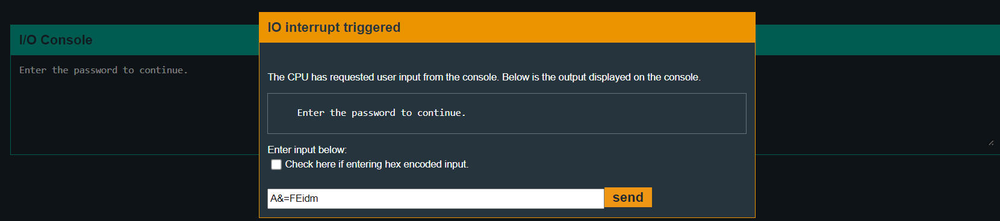
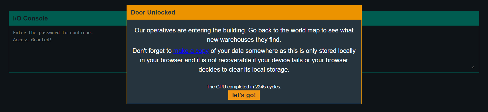

# Sydney

## main
Disassembly:
```assembly
4438 <main>
4438:  3150 9cff      add	#0xff9c, sp
443c:  3f40 b444      mov	#0x44b4 "Enter the password to continue.", r15
4440:  b012 6645      call	#0x4566 <puts>
4444:  0f41           mov	sp, r15
4446:  b012 8044      call	#0x4480 <get_password>
444a:  0f41           mov	sp, r15
444c:  b012 8a44      call	#0x448a <check_password>
4450:  0f93           tst	r15
4452:  0520           jnz	$+0xc <main+0x26>
4454:  3f40 d444      mov	#0x44d4 "Invalid password; try again.", r15
4458:  b012 6645      call	#0x4566 <puts>
445c:  093c           jmp	$+0x14 <main+0x38>
445e:  3f40 f144      mov	#0x44f1 "Access Granted!", r15
4462:  b012 6645      call	#0x4566 <puts>
4466:  3012 7f00      push	#0x7f
446a:  b012 0245      call	#0x4502 <INT>
446e:  2153           incd	sp
4470:  0f43           clr	r15
4472:  3150 6400      add	#0x64, sp
```

Pretty basic, program takes input from us using `get_password` function. Then calls the `check_password` function. And then again checks for `r15` to be not zero.

Lets have a look at `check_password` function.

## check_password

```assembly
448a <check_password>
448a:  bf90 4126 0000 cmp	#0x2641, 0x0(r15)
4490:  0d20           jnz	$+0x1c <check_password+0x22>
4492:  bf90 3d46 0200 cmp	#0x463d, 0x2(r15)
4498:  0920           jnz	$+0x14 <check_password+0x22>
449a:  bf90 4569 0400 cmp	#0x6945, 0x4(r15)
44a0:  0520           jnz	$+0xc <check_password+0x22>
44a2:  1e43           mov	#0x1, r14
44a4:  bf90 646d 0600 cmp	#0x6d64, 0x6(r15)
44aa:  0124           jz	$+0x4 <check_password+0x24>
44ac:  0e43           clr	r14
44ae:  0f4e           mov	r14, r15
44b0:  3041    
```
Here, program compares value at `0x0` bit at `r15` with 0x2641. Then `0x2` bit with `0x463d` and so on..
As these will be in little-endian format, the actual input should be:

`41263d464569646d` in ascii which is **A&=FEidm**.

So, we try this password.



And it works!