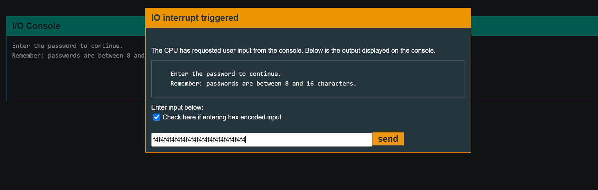

# Hanoi

## main
```assembly
4438 <main>
4438:  b012 2045      call	#0x4520 <login>
443c:  0f43           clr	r15
```
This time, main function directly directs to another function which is `login`. There is not anything else useful in this function.

## login
```assembly
4520 <login>
4520:  c243 1024      mov.b	#0x0, &0x2410
4524:  3f40 7e44      mov	#0x447e "Enter the password to continue.", r15
4528:  b012 de45      call	#0x45de <puts>
452c:  3f40 9e44      mov	#0x449e "Remember: passwords are between 8 and 16 characters.", r15
4530:  b012 de45      call	#0x45de <puts>
4534:  3e40 1c00      mov	#0x1c, r14
4538:  3f40 0024      mov	#0x2400, r15
453c:  b012 ce45      call	#0x45ce <getsn>
4540:  3f40 0024      mov	#0x2400, r15
4544:  b012 5444      call	#0x4454 <test_password_valid>
4548:  0f93           tst	r15
454a:  0324           jz	$+0x8 <login+0x32>
454c:  f240 a000 1024 mov.b	#0xa0, &0x2410
4552:  3f40 d344      mov	#0x44d3 "Testing if password is valid.", r15
4556:  b012 de45      call	#0x45de <puts>
455a:  f290 f400 1024 cmp.b	#0xf4, &0x2410
4560:  0720           jnz	$+0x10 <login+0x50>
4562:  3f40 f144      mov	#0x44f1 "Access granted.", r15
4566:  b012 de45      call	#0x45de <puts>
456a:  b012 4844      call	#0x4448 <unlock_door>
456e:  3041           ret
4570:  3f40 0145      mov	#0x4501 "That password is not correct.", r15
4574:  b012 de45      call	#0x45de <puts>
4578:  3041           ret
````
The program says that passwords are between 8, 16 characters and asks us input for such password.

`getsn` function is called to take input.

Lets have a look at `getsn` function first:
### getsn

```assembly
45ce <getsn>
45ce:  0e12           push	r14
45d0:  0f12           push	r15
45d2:  2312           push	#0x2
45d4:  b012 7a45      call	#0x457a <INT>
45d8:  3150 0600      add	#0x6, sp
45dc:  3041           ret
```
Ok, so first the values of `r14` and `r15` are pushed onto the stack. Then `0x2` is pushed and `#0x457a <INT>` is called which is an interrupt routine. 

Looking at the manual for interrupt listings:


(As `0x2` is being pushed here)

So, first which is address will be the one in `r15` and second i.e. maximum bytes to read will be in `r14`. So, this is kinda like the fgets function in glibc.

Before calling the `getsn` function, `0x1c` (28) was moved into `r14` and
`0x2400` was moved into `r15`.

**So, the `getsn` takes input of maximum `28` bytes at `0x2400` address.** This means that the program's instruction that password is between 8-16 characters only is false.

Ok, getting back to the `login` function. `0x2400` is again pushed into `r15` and now `test_password_valid` function is called. If after this function call, `r15` stores 0, then we jump to `4552`, otherwise moves `0xa0` at memory location `0x2410`, then continues same way from `4552`.

After this program just checks if value at memory location `0x2410` is **`0xf4`** or not and grants access if it is.

So, we don't want `0xa0` to be moved to memory location `0x2410` which was done when value of `r15` is not 0 at end of the `test_password_valid` function.

Lets have a look at the `test_password_valid` function now.

### test_password_valid


```assembly
4454 <test_password_valid>
4454:  0412           push	r4
4456:  0441           mov	sp, r4
4458:  2453           incd	r4
445a:  2183           decd	sp
445c:  c443 fcff      mov.b	#0x0, -0x4(r4)
4460:  3e40 fcff      mov	#0xfffc, r14
4464:  0e54           add	r4, r14
4466:  0e12           push	r14
4468:  0f12           push	r15
446a:  3012 7d00      push	#0x7d
446e:  b012 7a45      call	#0x457a <INT>
4472:  5f44 fcff      mov.b	-0x4(r4), r15
4476:  8f11           sxt	r15
4478:  3152           add	#0x8, sp
447a:  3441           pop	r4
447c:  3041           ret
```
It seems to be applying some operations. Mainly, we see another system interruption with `0x7d`


So, this takes two arguments. Here, first argument is value in `r14` and second is value in `r15`.

`r15` gets overwrited if password is correct.

So, at the end of this, we will get `r15` to be 0, which is what we wanted.
We can see this by setting a breakpoint after the `test_password_valid` function finishes.

Hence, we just need `0xf4` to be at memory address `0x2410` address. This is possible because we can give input upto 28 characters and not just 16. So, we give input as:
```
f4f4f4f4f4f4f4f4f4f4f4f4f4f4f4f4f4
```
(17 times `f4`)




And we are through !