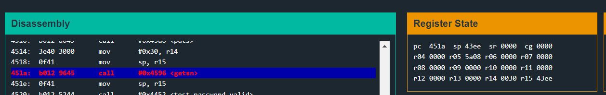
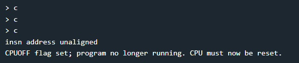
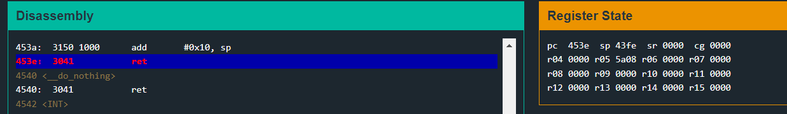
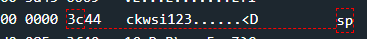
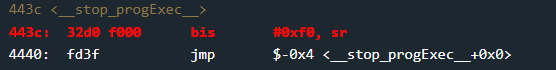
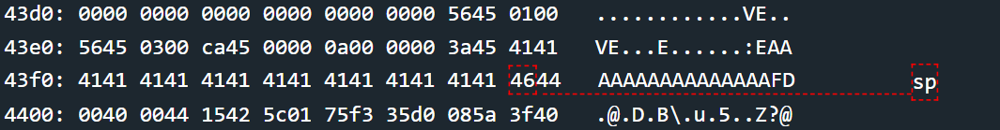
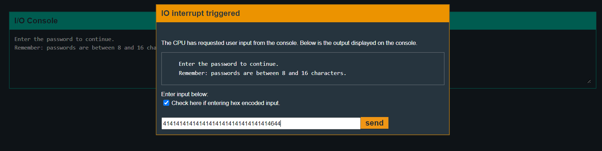
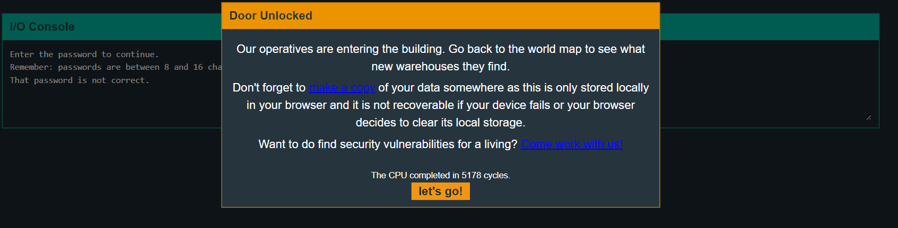

# Cusco
## main
```assembly
4438 <main>
4438:  b012 0045      call	#0x4500 <login>
```
Again, there is not much here. Directly login function is called.

## login

```assembly
4500 <login>
4500:  3150 f0ff      add	#0xfff0, sp
4504:  3f40 7c44      mov	#0x447c "Enter the password to continue.", r15
4508:  b012 a645      call	#0x45a6 <puts>
450c:  3f40 9c44      mov	#0x449c "Remember: passwords are between 8 and 16 characters.", r15
4510:  b012 a645      call	#0x45a6 <puts>
4514:  3e40 3000      mov	#0x30, r14
4518:  0f41           mov	sp, r15
451a:  b012 9645      call	#0x4596 <getsn>
451e:  0f41           mov	sp, r15
4520:  b012 5244      call	#0x4452 <test_password_valid>
4524:  0f93           tst	r15
4526:  0524           jz	$+0xc <login+0x32>
4528:  b012 4644      call	#0x4446 <unlock_door>
452c:  3f40 d144      mov	#0x44d1 "Access granted.", r15
4530:  023c           jmp	$+0x6 <login+0x36>
4532:  3f40 e144      mov	#0x44e1 "That password is not correct.", r15
4536:  b012 a645      call	#0x45a6 <puts>
453a:  3150 1000      add	#0x10, sp
453e:  3041           ret
```

Almost same as the login function in Hanoi. Just this time, we move `sp` in `r15` and `0x30` in `r14` before calling `getsn`. We know that `getsn` function will take input at address in `r15` which will be `sp` here of maximum `0x30` bytes (value in r14).

### test_password_valid
```assembly
4452 <test_password_valid>
4452:  0412           push	r4
4454:  0441           mov	sp, r4
4456:  2453           incd	r4
4458:  2183           decd	sp
445a:  c443 fcff      mov.b	#0x0, -0x4(r4)
445e:  3e40 fcff      mov	#0xfffc, r14
4462:  0e54           add	r4, r14
4464:  0e12           push	r14
4466:  0f12           push	r15
4468:  3012 7d00      push	#0x7d
446c:  b012 4245      call	#0x4542 <INT>
4470:  5f44 fcff      mov.b	-0x4(r4), r15
4474:  8f11           sxt	r15
4476:  3152           add	#0x8, sp
4478:  3441           pop	r4
447a:  3041           ret
447c .strings:
447c: "Enter the password to continue."
449c: "Remember: passwords are between 8 and 16 characters."
44d1: "Access granted."
44e1: "That password is not correct."
44ff: ""
```

This function, also seems same as earlier. Nothing interesting here.


So, we don't see any direct way to get access to the `unlock_door` function. This may mean that we have to take a different route which involves binary exploitation techniques.


Getting back to the login function, Lets check value in these registers just before `getsn` is called.



`r15` holds `43ee` and as seen before, `r14` holds `0030`. So, we can overwrite location from `43ee` to `441e`.

Lets try giving input of 48 characters: 48 times A.

On continuing, we get `insn address unaligned` on the Debugger Console:



This may mean that we have **overwritten the return address**. So, this is case of **Buffer Overflow**!

At the last `ret`, pops the return address off the stack (which is pointed by the stack pointer (`sp`) at the time and copies address to the program counter.)



For example, here `sp` contains address `43fe`, 
which points to the address `443c`



By stepping, we can see that return calls `<__step_progExec__>` at`443c`.



We also notice that address which holds the return address (`43fe`) can be overwritten by our input data as in the range of 48 bytes.

`0x43fe - 0x43ee = 0x10 = 16(decimal)`

So, in input we could `16` buffer characters, and then address of the `unlock_door` function, replacing the address of the `__step_progExec__`.

This way, the function now will return to the unlock_door function, which is what we want!

Address of `unlock_door` : `4446`.

So, our input will be: ` '41'*16 + '4644'`(Adjusted for little endian).

Input: **`414141414141414141414141414141414644`**

Lets, see if this is overwriting the address correctly.



Okay, so it seems to be overwriting the return address as we wanted. 





And it works successfully!
