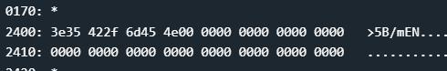
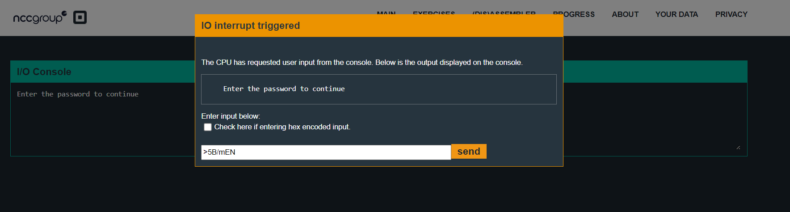

# New Orleans
## main
Disassembly:
```assembly
4438 <main>
4438:  3150 9cff      add	#0xff9c, sp
443c:  b012 7e44      call	#0x447e <create_password>
4440:  3f40 e444      mov	#0x44e4 "Enter the password to continue", r15
4444:  b012 9445      call	#0x4594 <puts>
4448:  0f41           mov	sp, r15
444a:  b012 b244      call	#0x44b2 <get_password>
444e:  0f41           mov	sp, r15
4450:  b012 bc44      call	#0x44bc <check_password>
4454:  0f93           tst	r15
4456:  0520           jnz	$+0xc <main+0x2a>
4458:  3f40 0345      mov	#0x4503 "Invalid password; try again.", r15
445c:  b012 9445      call	#0x4594 <puts>
4460:  063c           jmp	$+0xe <main+0x36>
4462:  3f40 2045      mov	#0x4520 "Access Granted!", r15
4466:  b012 9445      call	#0x4594 <puts>
446a:  b012 d644      call	#0x44d6 <unlock_door>
446e:  0f43           clr	r15
4470:  3150 6400      add	#0x64, sp
```
Alright, so first we see `<create_password>` function being called, after that it looks pretty much same as the function in `tutorial`. We, get access, if `r15` is not 0 at the end of `check_password` function.

So, lets see the `create_password` function first.

## create_password
Disassembly:
```assembly
447e <create_password>
447e:  3f40 0024      mov	#0x2400, r15
4482:  ff40 3e00 0000 mov.b	#0x3e, 0x0(r15)
4488:  ff40 3500 0100 mov.b	#0x35, 0x1(r15)
448e:  ff40 4200 0200 mov.b	#0x42, 0x2(r15)
4494:  ff40 2f00 0300 mov.b	#0x2f, 0x3(r15)
449a:  ff40 6d00 0400 mov.b	#0x6d, 0x4(r15)
44a0:  ff40 4500 0500 mov.b	#0x45, 0x5(r15)
44a6:  ff40 4e00 0600 mov.b	#0x4e, 0x6(r15)
44ac:  cf43 0700      mov.b	#0x0, 0x7(r15)
44b0:  3041           ret
```
First, `0x2400` is moved into `r15` which is a memory address. Then, using several `mov.b` instructions, some bytes are written into the location, one at a time.

Converting to ascii: `3e 35 42 2f 6d 45 4e`, we get **`>5B/mEN`**.



We can also see this data has been written after stepping into `create_password` function and stepping till `44ac`.

Alright, now lets check the `check_password` function.

## check_password
Disassembly:
```assembly
44bc <check_password>
44bc:  0e43           clr	r14
44be:  0d4f           mov	r15, r13
44c0:  0d5e           add	r14, r13
44c2:  ee9d 0024      cmp.b	@r13, 0x2400(r14)
44c6:  0520           jnz	$+0xc <check_password+0x16>
44c8:  1e53           inc	r14
44ca:  3e92           cmp	#0x8, r14
44cc:  f823           jnz	$-0xe <check_password+0x2>
44ce:  1f43           mov	#0x1, r15
44d0:  3041           ret
44d2:  0f43           clr	r15
44d4:  3041           ret
```
First, we clear `r14`, then `r15` is moved into `r13` and then `r14` value is added to `r13`.

Then we compare the byte at address `r13` and the one at `r14` byte of memory location `0x2400`.
These must be equal as we don't want to jump from `44c6`.

Then, `r14` is incremented and value is compared to `0x8`, if equal then, `0x1` is moved to `r15` else we return to starting of the function.

So, basically we are comparing the string **`>5B/mEN`** and our input character by character.

So, the password should just be the string **`>5B/mEN`**.




We enter the password, and it works!