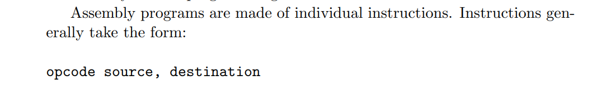
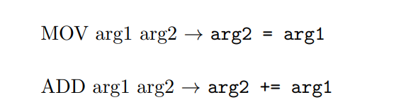
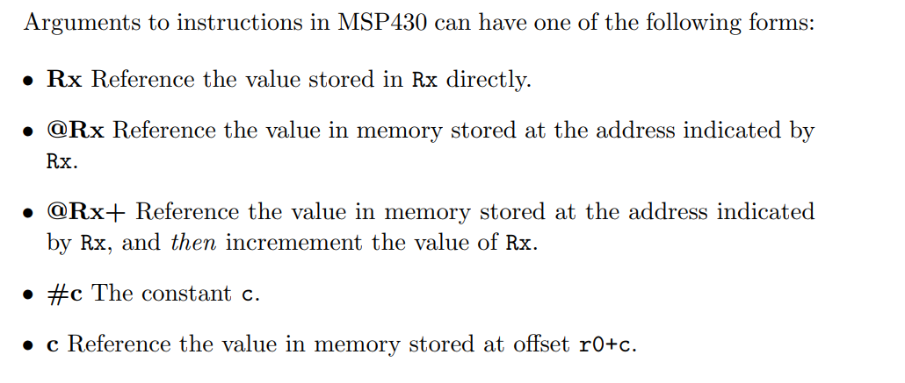
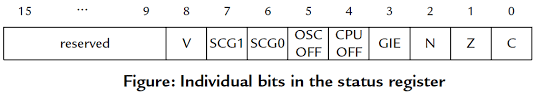

Few important things about MSP430:





**swpb** r12 stands for "swap bytes," meaning it swaps the high byte and low byte of a 16-bit register. Example: If r12 = 0x1234, after this instruction, r12 becomes 0x3412.
Purpose: It is often used when dealing with byte-order issues (like converting between little-endian and big-endian formats).

Instruction: **bis** r12, r11 (Bitwise OR between r12 and r11)
Operation: This instruction performs a bitwise OR of the contents of register r12 and r11, and stores the result in r11.

Instruction: **bit** #0x1, r15 (Test if bit 0 is set in register r15)
Operation: The bit instruction tests whether certain bits in a register are set. In this case, it checks whether the least significant bit (bit 0) of r15 is set.
The instruction performs a bitwise AND between r15 and #0x1, without modifying the contents of r15. It only updates the flags (Zero, Carry, etc.) based on the result.

If r15 & 0x1 equals 0, the Zero flag is set, indicating that the bit is not set.

Instruction: **clrc** (Clear Carry Flag)
Operation: This instruction clears the Carry flag (C) in the status register.
After executing this instruction, the carry flag will be set to 0 (cleared).

Instruction: **rrc** r12 (Rotate Right through Carry)
Operation: This instruction performs a right rotate operation on the contents of register r12, using the Carry flag to assist in the rotation.

The least significant bit (LSB) of r12 is moved into the Carry flag, and the Carry flag's previous value is shifted into the most significant bit (MSB) of r12.

The bits in r12 are rotated to the right, effectively shifting all bits right by one position while maintaining the bit that is shifted out by placing it in the Carry flag.
Example of the Operation:
Before executing rrc r12:

Let's assume r12 contains 0b10110011 (binary representation):
```
r12:  1 0 1 1 0 0 1 1  (This is 0xB3 in hexadecimal)
If the Carry flag was cleared just before this instruction (as done by clrc), the Carry flag is 0.
```
After executing rrc r12:

The LSB (1) from r12 moves into the Carry flag.
The Carry flag (0) shifts into the MSB of r12.
The contents of r12 become:
```
r12:  0 1 0 1 1 0 0 1  (This is 0x59 in hexadecimal)
The new Carry flag value after this operation will be 1.
```



Instruction Format:
**incd** r10 is typically an instruction used to increment the value in the register by 1. The exact behavior may depend on the architecture you are working with.